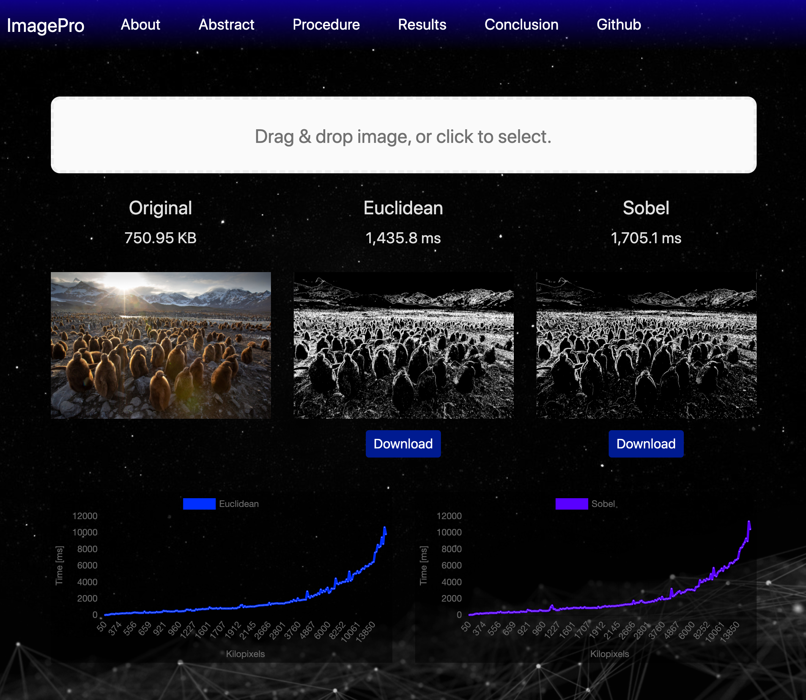
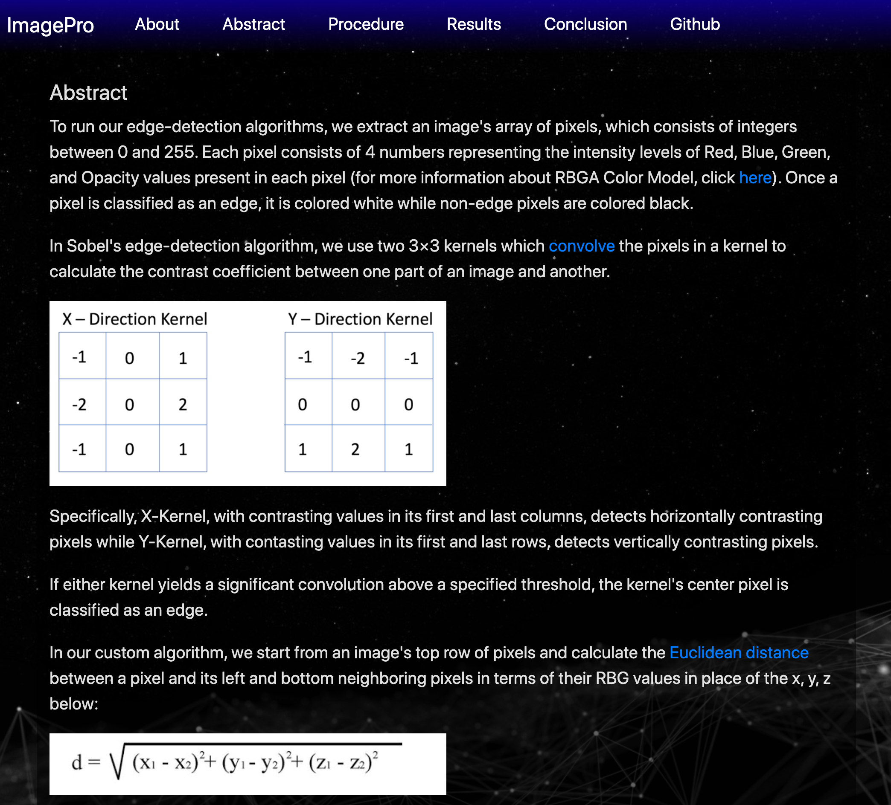
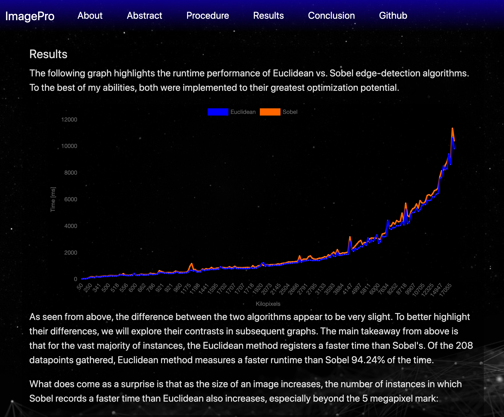

# CS3353_Project_4_Image_Processing
Fullstack web app that detects edges in a jpg file and conducts empirical analysis on 2 edge-detection algorithms: Custom (aka Euclidean) & Sobel

Feel free to clone this repo and run the application locally.

<b>Requirements</b>
- Node JS version 13.12.0 (latest)
- NPM version 6.14.4 (latest)

<b>To Run</b>
- `cd` into `frontend` directory and run `npm i`
- `cd` into `backend` directory and run `npm i`
- While in `backend` directory, run `npm start`
- Fire up a browser and go to `http://localhost:3000/`

Built with:  

<b>Screenshots</b>

